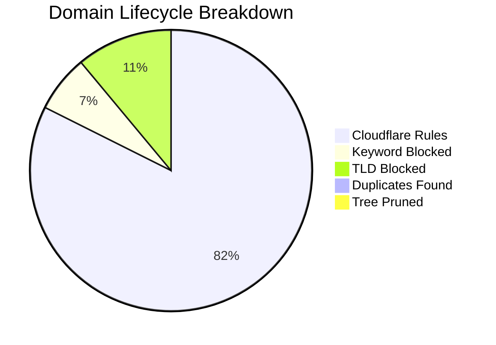

# 🛡️ Isaac's Cloudflare Intelligence Report
> **Last Update:** `2026-02-13 17:31:00` | **Sync Runtime:** `145.39s`

## 📊 Visual Insights

---

## 📋 Summary Metrics
| Metric | Count | % of Raw |
| :--- | :--- | :--- |
| **Total Raw Fetched** | 408,375 | 100% |
| **Aggressive Keyword Hit** | - 26,482 | 6.5% |
| **Banned TLD Block** | - 44,460 | 10.9% |
| **Duplicate/Tree Pruning** | - 4,107 | -- |
| **Active Rules Sent** | **332,244** | **81.4%** |

---

## 🚩 Top 12 Keyword Analytics
| `sex` | 9,815 |
| `porn` | 9,510 |
| `xxx` | 4,290 |
| `hentai` | 714 |
| `milf` | 523 |
| `fuck` | 506 |
| `bdsm` | 272 |
| `pussy` | 263 |
| `horny` | 239 |
| `tits` | 155 |
| `bondage` | 83 |
| `blowjob` | 36 |

---

## 🛰️ Provider Analytics (Uniqueness)
| Source | Raw Ingest | Valid Pool | Unique Contribution |
| :--- | :--- | :--- | :--- |
| Hagezi Badware Hoster | 1,298 | 1,230 | **91.8%** |
| Hagezi Anti-Piracy | 11,735 | 10,350 | **98.0%** |
| Hagezi Dynamic DNS | 1,482 | 1,413 | **87.7%** |
| HaGeZi Fake | 14,157 | 13,915 | **95.8%** |
| Hagezi Safeserach not Supported | 212 | 185 | **97.8%** |
| Hagezi DoH Only | 3,504 | 2,920 | **98.7%** |
| Hagezi NSFW | 67,316 | 35,633 | **98.7%** |
| HaGeZi Ultimate | 308,671 | 270,705 | **99.5%** |

---

## 🛠️ Infrastructure Health
* **Avg Entropy (Randomness):** `3.45`
* **Max Domain Length:** `179`
* **Cloudflare Quota Usage:** `110.75%`
