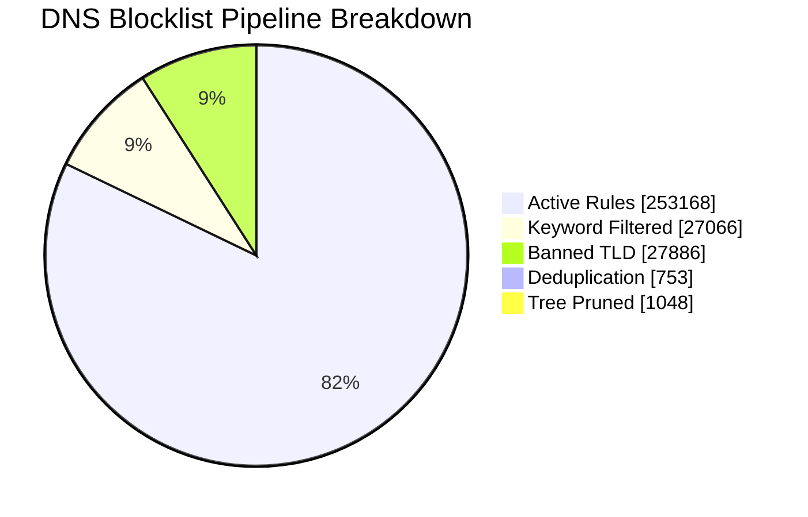

<!--
  Auto-generated by sync_blocklist.py — do not edit manually.
  Changes will be overwritten on next sync.
-->

<div align="center">

# 🛡️ DNS Intelligence Report

**Cloudflare Gateway · Ads, Tracker, Telemetry & Malware Blocklist**


</div>

---

## ⚡ At a Glance

| | Metric | Value | |
|:---:|:---|---:|:---|
| 🌐 | **Sources Active** | `5` | feeds ingested this sync |
| 📥 | **Raw Domains Fetched** | `310,243` | before any filtering |
| ✅ | **Active Block Rules** | `253,168` | pushed to Cloudflare |
| 🧹 | **Total Filtered Out** | `57,075` | noise removed |
| 🔁 | **Duplicates Removed** | `753` | cross-source overlap |
| 🌳 | **Subdomains Tree-Pruned** | `1,048` | covered by parent rule |
| ⏱️ | **Sync Runtime** | `92.94s` | wall clock |
| 📦 | **Cloudflare List Chunks** | `254` | × 1,000 domains each |

---

## 📊 Pipeline Funnel

> From **310,243 raw domains** down to **253,168 precision block rules** — a 18.4% reduction in noise.



---

## 🗺️ Execution Timeline


---

## 📉 Cloudflare Quota Consumption

```
Gateway Rule Limit: 300,000
██████████████████████████████████░░░░░░  84.4%  253,168 / 300,000  [🟠 High]
```

### Filter Stage Breakdown

| Stage | Domains | Share of Raw | Visual |
| :--- | ---: | ---: | :--- |
| 🔴 Keyword Filtered  | 27,066  | 8.72%  | `██░░░░░░░░░░░░░░░░░░░░░░░░░░  8.7%` |
| 🟠 Banned TLD        | 27,886 | 8.99% | `███░░░░░░░░░░░░░░░░░░░░░░░░░  9.0%` |
| 🟡 Dedup + Tree Prune | 1,801 | 0.58% | `░░░░░░░░░░░░░░░░░░░░░░░░░░░░  0.6%` |
| 🟢 **Active Rules**  | **253,168** | **81.6%** | `███████████████████████░░░░░  81.6%` |

---

## 🛰️ Source Intelligence

```mermaid
xychart-beta horizontal
    title "Source — Valid Domains Ingested"
    x-axis ['"Hagezi SafeSearch Not "', '"HaGeZi Fake"', '"Hagezi Anti-Piracy"', '"Hagezi NSFW"', '"HaGeZi Pro++"']
    y-axis "Domains"
    bar [186, 13751, 10291, 34014, 196727]
    line [186, 13751, 10291, 34014, 196727]
```

### Uniqueness Ranking

> The **line** in the chart above shows unique-only contribution per source.
> A source with high valid count but low uniqueness is largely redundant.

| Source | Raw Ingest | Valid | Unique Only | Uniqueness Bar | Rank |
| :--- | ---: | ---: | ---: | :--- | :---: |
| HaGeZi Pro++ |    218,289 |    196,727 |   196,727 | `████████████████  100.0%` | 🥇 |
| Hagezi NSFW |     66,067 |     34,014 |    34,014 | `████████████████  100.0%` | 🥈 |
| HaGeZi Fake |     13,984 |     13,751 |    13,751 | `████████████████  100.0%` | 🥉 |
| Hagezi Anti-Piracy |     11,689 |     10,291 |    10,291 | `████████████████  100.0%` | · |
| Hagezi SafeSearch Not Supported |        214 |        186 |       186 | `████████████████  100.0%` | · |

### Source Quality Matrix

> **X-axis:** what % of a source's domains are unique (not in any other source).
> **Y-axis:** average domain length — longer domains tend to be more specific / less spammy.

```mermaid
quadrantChart
    title Source Quality Matrix (Uniqueness vs Avg Domain Length)
    x-axis "Low Uniqueness" --> "High Uniqueness"
    y-axis "Short Domains" --> "Long Domains"
    quadrant-1 High Signal
    quadrant-2 Deep Coverage
    quadrant-3 Redundant
    quadrant-4 Short & Unique
        Hagezi SafeSearch No(100.0, 16.0)
        HaGeZi Fake(100.0, 16.0)
        Hagezi Anti-Piracy(100.0, 14.0)
        Hagezi NSFW(100.0, 15.0)
        HaGeZi Pro++(100.0, 19.0)
```

---

## 🚫 Keyword Filter Intelligence

```mermaid
xychart-beta
    title "Top 10 Offloaded Keyword Hits"
    x-axis ['"porn"', '"sex"', '"xxx"', '"sexy"', '"hentai"', '"fuck"', '"milf"', '"xvideo"', '"erotic"', '"xnxx"']
    y-axis "Blocked Domains"
    bar [9554, 8491, 3440, 927, 655, 517, 485, 444, 437, 277]
```

### Full Keyword Hit Table (Top 15)

| Keyword | Blocked | Distribution |
| :--- | ---: | :--- |
| `porn                ` |    9,554 | `██████████████████████  100.0%` |
| `sex                 ` |    8,491 | `████████████████████░░  88.9%` |
| `xxx                 ` |    3,440 | `████████░░░░░░░░░░░░░░  36.0%` |
| `sexy                ` |      927 | `██░░░░░░░░░░░░░░░░░░░░  9.7%` |
| `hentai              ` |      655 | `██░░░░░░░░░░░░░░░░░░░░  6.9%` |
| `fuck                ` |      517 | `█░░░░░░░░░░░░░░░░░░░░░  5.4%` |
| `milf                ` |      485 | `█░░░░░░░░░░░░░░░░░░░░░  5.1%` |
| `xvideo              ` |      444 | `█░░░░░░░░░░░░░░░░░░░░░  4.6%` |
| `erotic              ` |      437 | `█░░░░░░░░░░░░░░░░░░░░░  4.6%` |
| `xnxx                ` |      277 | `█░░░░░░░░░░░░░░░░░░░░░  2.9%` |
| `bdsm                ` |      264 | `█░░░░░░░░░░░░░░░░░░░░░  2.8%` |
| `xxvideo             ` |      255 | `█░░░░░░░░░░░░░░░░░░░░░  2.7%` |
| `shemale             ` |      249 | `█░░░░░░░░░░░░░░░░░░░░░  2.6%` |
| `pussy               ` |      246 | `█░░░░░░░░░░░░░░░░░░░░░  2.6%` |
| `horny               ` |      211 | `░░░░░░░░░░░░░░░░░░░░░░  2.2%` |

---

## 🌍 Banned TLD Intelligence

```mermaid
xychart-beta
    title "Top Banned TLD Hits"
    x-axis ['".ru"', '".top"', '".xyz"', '".cn"', '".click"', '".cfd"', '".cc"', '".icu"', '".sbs"', '".rest"']
    y-axis "Blocked Domains"
    bar [4821, 4522, 4454, 2716, 2366, 1947, 1532, 1358, 842, 772]
```

### Top Offending TLDs

| TLD | Blocked | Distribution |
| :--- | ---: | :--- |
| `.ru          ` |    4,821 | `██████████████████████  100.0%` |
| `.top         ` |    4,522 | `█████████████████████░  93.8%` |
| `.xyz         ` |    4,454 | `████████████████████░░  92.4%` |
| `.cn          ` |    2,716 | `████████████░░░░░░░░░░  56.3%` |
| `.click       ` |    2,366 | `███████████░░░░░░░░░░░  49.1%` |
| `.cfd         ` |    1,947 | `█████████░░░░░░░░░░░░░  40.4%` |
| `.cc          ` |    1,532 | `███████░░░░░░░░░░░░░░░  31.8%` |
| `.icu         ` |    1,358 | `██████░░░░░░░░░░░░░░░░  28.2%` |
| `.sbs         ` |      842 | `████░░░░░░░░░░░░░░░░░░  17.5%` |
| `.rest        ` |      772 | `████░░░░░░░░░░░░░░░░░░  16.0%` |

---

## 🔬 Domain Health & Entropy

| Metric | Value | Interpretation |
| :--- | :--- | :--- |
| **Avg Shannon Entropy** | `3.448 bits` | 🟢 Normal — human-readable domains |
| **Max Domain Length** | `179 chars` | longest domain in the active ruleset |
| **Entropy Distribution** | `      ▁▃█▅` | low entropy → high entropy (across 5k sample) |

> **Shannon Entropy** measures character randomness per domain string.
> Scores above `4.0` may indicate algorithmically-generated domains (DGA malware).
> Human-readable ad/tracker domains typically score between `2.5` and `3.5`.

---

## ⚙️ Configuration Reference

| Parameter | Value | Description |
| :--- | :--- | :--- |
| `TOTAL_QUOTA` | `300,000` | Cloudflare Gateway rule limit |
| `MAX_LIST_SIZE` | `1,000` | Domains per list chunk |
| `MAX_WORKERS` | `5` | Concurrent fetch threads |
| `MAX_RETRIES` | `3` | Per-request retry attempts |
| `TOP_KEYWORDS` | `15` | Rows shown in keyword table |
| `TOP_TLDS` | `10` | Rows shown in TLD table |

---

<div align="center">

*Auto-generated · `2026-02-21 02:28:42` · [sync_blocklist.py](./sync_blocklist.py)*

</div>
