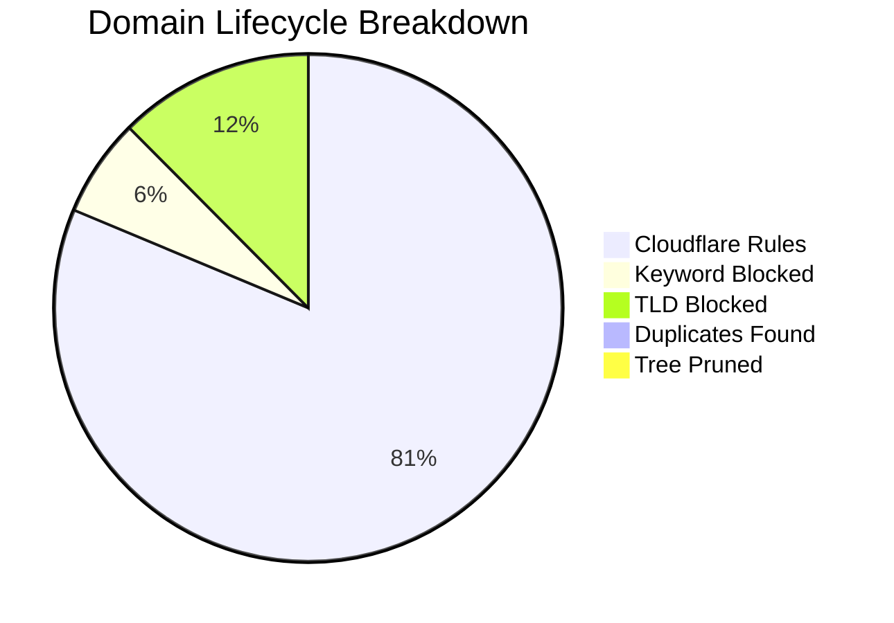

# 🛡️ Isaac's Cloudflare Intelligence Report
> **Last Update:** `2026-02-13 19:01:45` | **Sync Runtime:** `117.18s`

## 📊 Visual Insights

---

## 📋 Summary Metrics
| Metric | Count | % of Raw |
| :--- | :--- | :--- |
| **Total Raw Fetched** | 427,912 | 100% |
| **Aggressive Keyword Hit** | - 26,534 | 6.2% |
| **Banned TLD Block** | - 52,795 | 12.3% |
| **Duplicate/Tree Pruning** | - 2,175 | -- |
| **Active Rules Sent** | **345,022** | **80.6%** |

---

## 🚩 Top 12 Keyword Analytics
| `sex` | 10,530 |
| `porn` | 9,622 |
| `xxx` | 3,433 |
| `hentai` | 655 |
| `fuck` | 545 |
| `milf` | 502 |
| `bdsm` | 274 |
| `horny` | 239 |
| `pussy` | 234 |
| `pornhub` | 138 |
| `tits` | 129 |
| `bondage` | 80 |

---

## 🛰️ Provider Analytics (Uniqueness)
| Source | Raw Ingest | Valid Pool | Unique Contribution |
| :--- | :--- | :--- | :--- |
| HaGeZi Fake | 14,157 | 13,915 | **95.7%** |
| Hagezi NSFW | 67,303 | 35,593 | **98.6%** |
| Hagezi Anti-Piracy | 11,735 | 10,350 | **98.0%** |
| HaGeZi Ultimate | 334,717 | 287,339 | **99.6%** |

---

## 🛠️ Infrastructure Health
* **Avg Entropy (Randomness):** `3.452`
* **Max Domain Length:** `179`
* **Cloudflare Quota Usage:** `115.01%`
