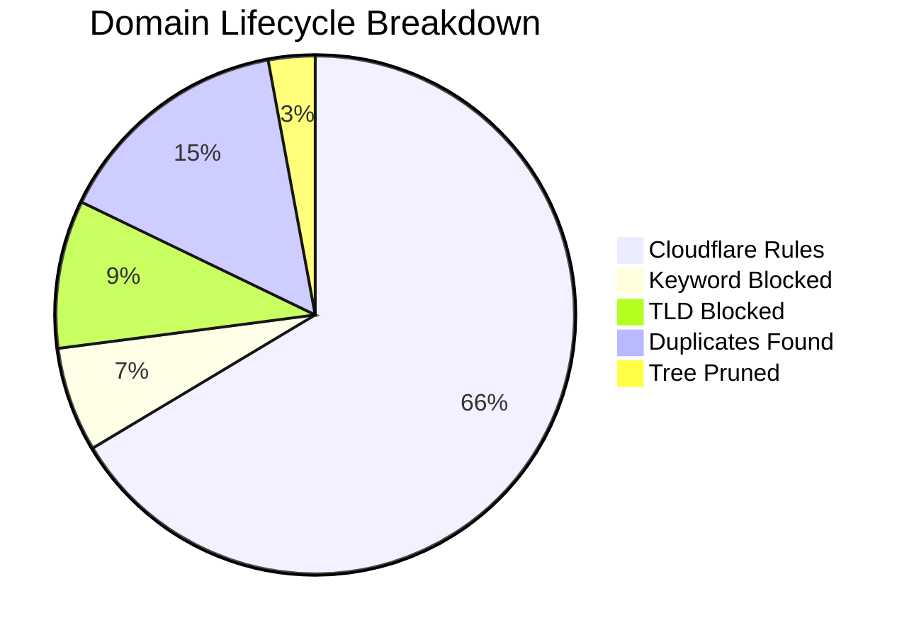

# 🛡️ Isaac's Cloudflare Intelligence Report
> **Last Update:** `2026-02-15 13:03:35` | **Sync Runtime:** `106.62s`

## 📊 Visual Insights

---

## 📋 Summary Metrics
| Metric | Count | % of Raw |
| :--- | :--- | :--- |
| **Total Raw Fetched** | 423,778 | 100% |
| **Aggressive Keyword Hit** | - 27,645 | 6.5% |
| **Banned TLD Block** | - 39,075 | 9.2% |
| **Duplicate/Tree Pruning** | - 75,493 | -- |
| **Active Rules Sent** | **281,083** | **66.3%** |

---

## 🚩 Top 12 Keyword Analytics
| `porn` | 9,719 |
| `sex` | 8,504 |
| `xxx` | 3,210 |
| `sexy` | 1,013 |
| `xvideo` | 718 |
| `hentai` | 708 |
| `xnxx` | 620 |
| `fuck` | 539 |
| `milf` | 523 |
| `erotic` | 430 |
| `shemale` | 259 |
| `pussy` | 255 |

---

## 🛰️ Provider Analytics (Uniqueness)
| Source | Raw Ingest | Valid Pool | Unique Contribution |
| :--- | :--- | :--- | :--- |
| Hagezi Anti-Piracy | 11,739 | 10,349 | **98.0%** |
| HaGeZi Fake | 14,121 | 13,878 | **96.9%** |
| Hagezi SafeSearch Not Supported | 214 | 186 | **98.4%** |
| Hagezi NSFW | 66,768 | 34,153 | **98.8%** |
| 1Hosts Lite | 94,050 | 88,034 | **29.2%** |
| HaGeZi Pro++ | 236,886 | 209,976 | **70.0%** |

---

## 🛠️ Infrastructure Health
* **Avg Entropy (Randomness):** `3.448`
* **Max Domain Length:** `179`
* **Cloudflare Quota Usage:** `93.69%`
