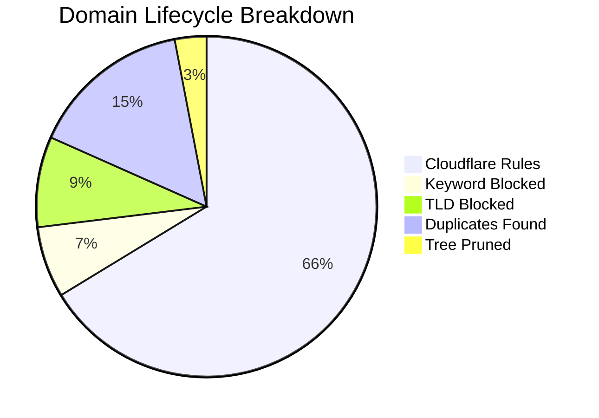

# 🛡️ Isaac's Cloudflare Intelligence Report
> **Last Update:** `2026-02-19 22:38:47` | **Sync Runtime:** `83.86s`

## 📊 Visual Insights

---

## 📋 Summary Metrics
| Metric | Count | % of Raw |
| :--- | :--- | :--- |
| **Total Raw Fetched** | 409,083 | 100% |
| **Aggressive Keyword Hit** | - 27,626 | 6.8% |
| **Banned TLD Block** | - 35,121 | 8.6% |
| **Duplicate/Tree Pruning** | - 74,995 | -- |
| **Active Rules Sent** | **271,023** | **66.3%** |

---

## 🚩 Top 12 Keyword Analytics
| `sex` | 9,126 |
| `porn` | 8,840 |
| `xxx` | 3,366 |
| `sexy` | 1,011 |
| `hentai` | 721 |
| `xvideo` | 703 |
| `xnxx` | 655 |
| `milf` | 554 |
| `fuck` | 528 |
| `erotic` | 452 |
| `pussy` | 270 |
| `bdsm` | 270 |

---

## 🛰️ Provider Analytics (Uniqueness)
| Source | Raw Ingest | Valid Pool | Unique Contribution |
| :--- | :--- | :--- | :--- |
| Hagezi Anti-Piracy | 11,681 | 10,287 | **98.1%** |
| HaGeZi Fake | 13,962 | 13,729 | **97.8%** |
| Hagezi SafeSearch Not Supported | 214 | 186 | **98.4%** |
| Hagezi NSFW | 66,387 | 34,109 | **98.8%** |
| HaGeZi Pro++ | 223,785 | 200,477 | **68.8%** |
| 1Hosts Lite | 93,054 | 87,230 | **29.0%** |

---

## 🛠️ Infrastructure Health
* **Avg Entropy (Randomness):** `3.448`
* **Max Domain Length:** `179`
* **Cloudflare Quota Usage:** `90.34%`
