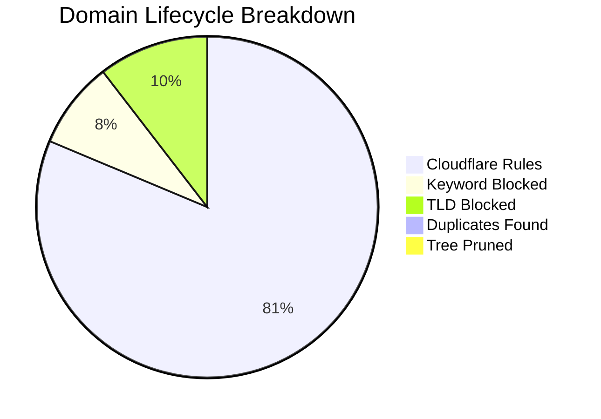

# 🛡️ Isaac's Cloudflare Intelligence Report
> **Last Update:** `2026-02-13 21:19:47` | **Sync Runtime:** `117.86s`

## 📊 Visual Insights

---

## 📋 Summary Metrics
| Metric | Count | % of Raw |
| :--- | :--- | :--- |
| **Total Raw Fetched** | 338,263 | 100% |
| **Aggressive Keyword Hit** | - 27,676 | 8.2% |
| **Banned TLD Block** | - 35,064 | 10.4% |
| **Duplicate/Tree Pruning** | - 1,988 | -- |
| **Active Rules Sent** | **273,021** | **80.7%** |

---

## 🚩 Top 12 Keyword Analytics
| `porn` | 9,189 |
| `sex` | 9,017 |
| `xxx` | 4,301 |
| `sexy` | 993 |
| `hentai` | 649 |
| `milf` | 537 |
| `fuck` | 502 |
| `erotic` | 421 |
| `xnxx` | 334 |
| `bdsm` | 269 |
| `shemale` | 253 |
| `xvideo` | 244 |

---

## 🛰️ Provider Analytics (Uniqueness)
| Source | Raw Ingest | Valid Pool | Unique Contribution |
| :--- | :--- | :--- | :--- |
| Hagezi Anti-Piracy | 11,735 | 10,347 | **98.1%** |
| HaGeZi Fake | 14,157 | 13,914 | **96.4%** |
| Hagezi Safeserach not Supported | 214 | 186 | **98.4%** |
| Hagezi NSFW | 67,303 | 34,316 | **99.0%** |
| HaGeZi Pro++ | 244,854 | 216,246 | **99.6%** |

---

## 🛠️ Infrastructure Health
* **Avg Entropy (Randomness):** `3.449`
* **Max Domain Length:** `179`
* **Cloudflare Quota Usage:** `91.01%`
