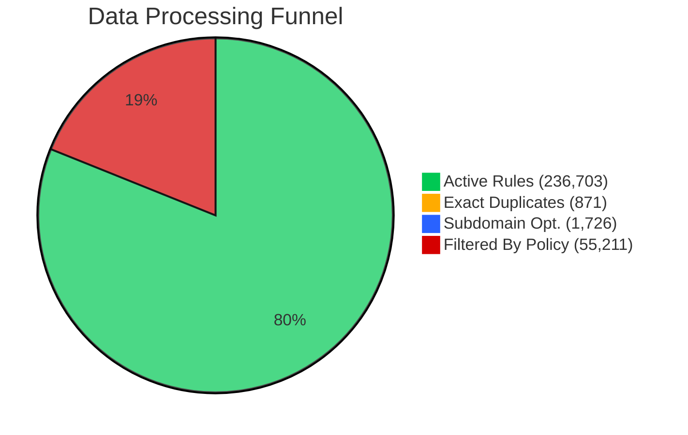
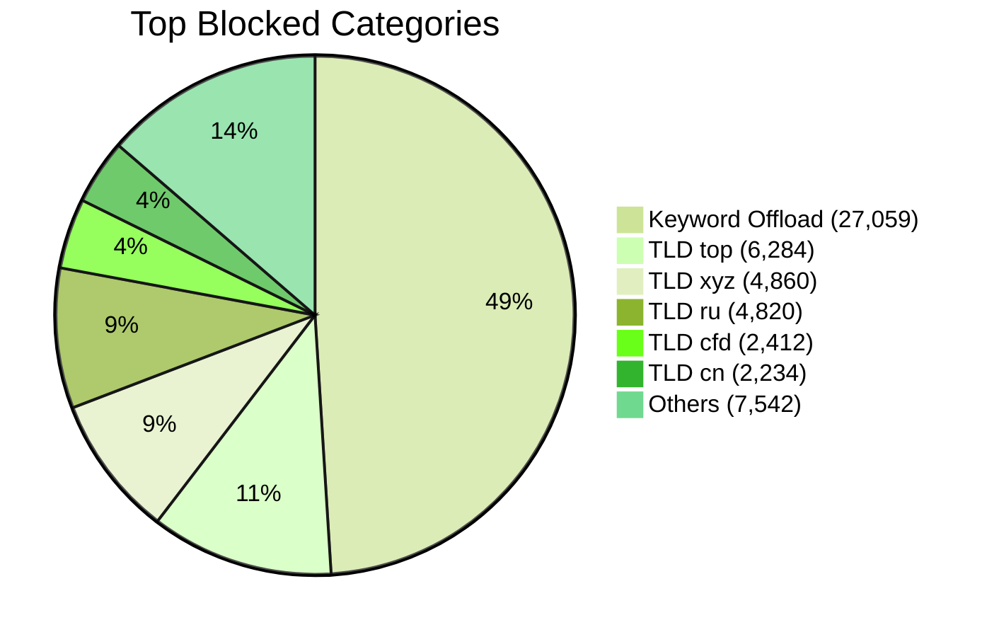

# 🛡️ Cloudflare Zero Trust Intelligence Report
> **Cycle Updated:** `2026-02-13 15:50:42` | **Runtime:** `2.88s` | **Status:** 🟢

## 📊 Visual Insights

### Data Processing Funnel
How raw inputs are transformed into active rules.

### Top Filtered Categories
What is being removed before optimization.

---

## 📋 Summary Metrics
| Metric | Count | % of Raw |
| :--- | :--- | :--- |
| **Total Ingested** | 294,511 | 100% |
| **Active Rules (Final)** | **236,703** | **80.4%** |
| **Noise Removed** | 57,808 | |

---

## 🚩 Deep Analytics & Trends
| Indicator | Value | Insight |
| :--- | :--- | :--- |
| **Cloudflare Quota** | `78.9%` | Used 236,703 of 300,000 |
| **Average Domain Entropy** | `3.435` | High entropy (>4.0) suggests DGA/Malware |
| **Max Domain Length** | `82` chars | Extremely long names are anomaly markers |
| **Common FQDN Depth** | `2.33` levels | Average subdomains per root |
| **API Chunks** | `237` lists | Total lists managed in Cloudflare Gateway |

---

## 🛰️ Provider Effectiveness
| Source | Raw Ingest | Validated | Clean Efficiency |
| :--- | :--- | :--- | :--- |
| Hagezi DoH Only | 3,504 | 2,959 | 84.4% |
| Hagezi Badware Hoster | 1,298 | 1,238 | 95.4% |
| Hagezi Safeserach not Supported | 212 | 188 | 88.7% |
| Hagezi Dynamic DNS | 1,482 | 1,423 | 96.0% |
| Hagezi Anti-Piracy | 11,735 | 10,542 | 89.8% |
| HaGeZi Fake | 14,157 | 13,950 | 98.5% |
| Hagezi NSFW | 67,316 | 35,492 | 52.7% |
| HaGeZi Pro | 194,807 | 173,508 | 89.1% |

---

## 🛑 Top 25 Filtered Categories List
| Reason / TLD | Count |
| :--- | :--- |
| Keyword Offload | 27,059 |
| TLD: top | 6,284 |
| TLD: xyz | 4,860 |
| TLD: ru | 4,820 |
| TLD: cfd | 2,412 |
| TLD: cn | 2,234 |
| TLD: click | 1,899 |
| TLD: icu | 1,124 |
| TLD: rest | 997 |
| TLD: sbs | 570 |
| TLD: link | 518 |
| Invalid/IDN/IP | 443 |
| TLD: buzz | 221 |
| TLD: work | 213 |
| TLD: su | 194 |
| TLD: pw | 181 |
| TLD: ir | 177 |
| TLD: win | 125 |
| TLD: bid | 123 |
| TLD: monster | 104 |
| TLD: stream | 81 |
| TLD: bar | 70 |
| TLD: bet | 68 |
| TLD: by | 39 |
| TLD: party | 39 |
