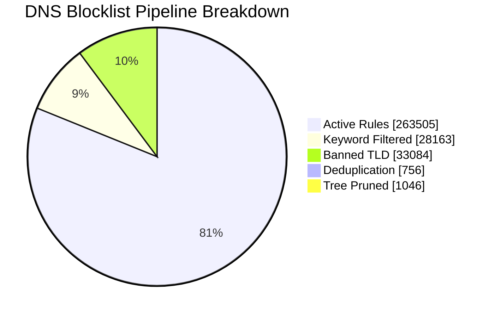

<!--
  Auto-generated by sync_blocklist.py — do not edit manually.
  Changes will be overwritten on next sync.
-->

<div align="center">

# 🛡️ DNS Intelligence Report

**Cloudflare Gateway · Ads, Tracker, Telemetry & Malware Blocklist**


</div>

---

## ⚡ At a Glance

| | Metric | Value | |
|:---:|:---|---:|:---|
| 🌐 | **Sources Active** | `5` | feeds ingested this sync |
| 📥 | **Raw Domains Fetched** | `326,878` | before any filtering |
| ✅ | **Active Block Rules** | `263,505` | pushed to Cloudflare |
| 🧹 | **Total Filtered Out** | `63,373` | noise removed |
| 🔁 | **Duplicates Removed** | `756` | cross-source overlap |
| 🌳 | **Subdomains Tree-Pruned** | `1,046` | covered by parent rule |
| ⏱️ | **Sync Runtime** | `84.04s` | wall clock |
| 📦 | **Cloudflare List Chunks** | `264` | × 1,000 domains each |

---

## 📊 Pipeline Funnel

> From **326,878 raw domains** down to **263,505 precision block rules** — a 19.4% reduction in noise.



---

## 🗺️ Execution Timeline


---

## 📉 Cloudflare Quota Consumption

```
Gateway Rule Limit: 300,000
███████████████████████████████████░░░░░  87.8%  263,505 / 300,000  [🟠 High]
```

### Filter Stage Breakdown

| Stage | Domains | Share of Raw | Visual |
| :--- | ---: | ---: | :--- |
| 🔴 Keyword Filtered  | 28,163  | 8.62%  | `██░░░░░░░░░░░░░░░░░░░░░░░░░░  8.6%` |
| 🟠 Banned TLD        | 33,084 | 10.12% | `███░░░░░░░░░░░░░░░░░░░░░░░░░  10.1%` |
| 🟡 Dedup + Tree Prune | 1,802 | 0.55% | `░░░░░░░░░░░░░░░░░░░░░░░░░░░░  0.6%` |
| 🟢 **Active Rules**  | **263,505** | **80.61%** | `███████████████████████░░░░░  80.6%` |

---

## 🛰️ Source Intelligence

```mermaid
xychart-beta horizontal
    title "Source — Valid Domains Ingested"
    x-axis ['"Hagezi Anti-Piracy"', '"Hagezi SafeSearch Not "', '"HaGeZi Fake"', '"Hagezi NSFW"', '"HaGeZi Pro++"']
    y-axis "Domains"
    bar [10298, 186, 14213, 34435, 206175]
    line [10298, 186, 14213, 34435, 206175]
```

### Uniqueness Ranking

> The **line** in the chart above shows unique-only contribution per source.
> A source with high valid count but low uniqueness is largely redundant.

| Source | Raw Ingest | Valid | Unique Only | Uniqueness Bar | Rank |
| :--- | ---: | ---: | ---: | :--- | :---: |
| HaGeZi Pro++ |    232,727 |    206,175 |   206,175 | `████████████████  100.0%` | 🥇 |
| Hagezi NSFW |     67,787 |     34,435 |    34,435 | `████████████████  100.0%` | 🥈 |
| HaGeZi Fake |     14,452 |     14,213 |    14,213 | `████████████████  100.0%` | 🥉 |
| Hagezi Anti-Piracy |     11,698 |     10,298 |    10,298 | `████████████████  100.0%` | · |
| Hagezi SafeSearch Not Supported |        214 |        186 |       186 | `████████████████  100.0%` | · |

### Source Quality Matrix

> **X-axis:** what % of a source's domains are unique (not in any other source).
> **Y-axis:** average domain length — longer domains tend to be more specific / less spammy.

```mermaid
quadrantChart
    title Source Quality Matrix (Uniqueness vs Avg Domain Length)
    x-axis "Low Uniqueness" --> "High Uniqueness"
    y-axis "Short Domains" --> "Long Domains"
    quadrant-1 High Signal
    quadrant-2 Deep Coverage
    quadrant-3 Redundant
    quadrant-4 Short & Unique
        Hagezi Anti-Piracy(100.0, 14.0)
        Hagezi SafeSearch No(100.0, 16.0)
        HaGeZi Fake(100.0, 16.0)
        Hagezi NSFW(100.0, 15.0)
        HaGeZi Pro++(100.0, 19.0)
```

---

## 🚫 Keyword Filter Intelligence

```mermaid
xychart-beta
    title "Top 10 Offloaded Keyword Hits"
    x-axis ['"sex"', '"porn"', '"xxx"', '"sexy"', '"hentai"', '"milf"', '"fuck"', '"erotic"', '"xnxx"', '"bdsm"']
    y-axis "Blocked Domains"
    bar [9549, 8955, 4286, 1051, 669, 548, 466, 445, 324, 280]
```

### Full Keyword Hit Table (Top 15)

| Keyword | Blocked | Distribution |
| :--- | ---: | :--- |
| `sex                 ` |    9,549 | `██████████████████████  100.0%` |
| `porn                ` |    8,955 | `█████████████████████░  93.8%` |
| `xxx                 ` |    4,286 | `██████████░░░░░░░░░░░░  44.9%` |
| `sexy                ` |    1,051 | `██░░░░░░░░░░░░░░░░░░░░  11.0%` |
| `hentai              ` |      669 | `██░░░░░░░░░░░░░░░░░░░░  7.0%` |
| `milf                ` |      548 | `█░░░░░░░░░░░░░░░░░░░░░  5.7%` |
| `fuck                ` |      466 | `█░░░░░░░░░░░░░░░░░░░░░  4.9%` |
| `erotic              ` |      445 | `█░░░░░░░░░░░░░░░░░░░░░  4.7%` |
| `xnxx                ` |      324 | `█░░░░░░░░░░░░░░░░░░░░░  3.4%` |
| `bdsm                ` |      280 | `█░░░░░░░░░░░░░░░░░░░░░  2.9%` |
| `xvideo              ` |      272 | `█░░░░░░░░░░░░░░░░░░░░░  2.8%` |
| `pussy               ` |      244 | `█░░░░░░░░░░░░░░░░░░░░░  2.6%` |
| `horny               ` |      221 | `█░░░░░░░░░░░░░░░░░░░░░  2.3%` |
| `shemale             ` |      204 | `░░░░░░░░░░░░░░░░░░░░░░  2.1%` |
| `tits                ` |      144 | `░░░░░░░░░░░░░░░░░░░░░░  1.5%` |

---

## 🌍 Banned TLD Intelligence

```mermaid
xychart-beta
    title "Top Banned TLD Hits"
    x-axis ['".top"', '".ru"', '".xyz"', '".click"', '".cn"', '".cfd"', '".cc"', '".sbs"', '".icu"', '".casino"']
    y-axis "Blocked Domains"
    bar [6324, 5141, 4614, 2713, 2711, 2042, 1560, 1525, 1408, 1183]
```

### Top Offending TLDs

| TLD | Blocked | Distribution |
| :--- | ---: | :--- |
| `.top         ` |    6,324 | `██████████████████████  100.0%` |
| `.ru          ` |    5,141 | `██████████████████░░░░  81.3%` |
| `.xyz         ` |    4,614 | `████████████████░░░░░░  73.0%` |
| `.click       ` |    2,713 | `█████████░░░░░░░░░░░░░  42.9%` |
| `.cn          ` |    2,711 | `█████████░░░░░░░░░░░░░  42.9%` |
| `.cfd         ` |    2,042 | `███████░░░░░░░░░░░░░░░  32.3%` |
| `.cc          ` |    1,560 | `█████░░░░░░░░░░░░░░░░░  24.7%` |
| `.sbs         ` |    1,525 | `█████░░░░░░░░░░░░░░░░░  24.1%` |
| `.icu         ` |    1,408 | `█████░░░░░░░░░░░░░░░░░  22.3%` |
| `.casino      ` |    1,183 | `████░░░░░░░░░░░░░░░░░░  18.7%` |

---

## 🔬 Domain Health & Entropy

| Metric | Value | Interpretation |
| :--- | :--- | :--- |
| **Avg Shannon Entropy** | `3.452 bits` | 🟢 Normal — human-readable domains |
| **Max Domain Length** | `179 chars` | longest domain in the active ruleset |
| **Entropy Distribution** | `      ▁▄█▅` | low entropy → high entropy (across 5k sample) |

> **Shannon Entropy** measures character randomness per domain string.
> Scores above `4.0` may indicate algorithmically-generated domains (DGA malware).
> Human-readable ad/tracker domains typically score between `2.5` and `3.5`.

---

## ⚙️ Configuration Reference

| Parameter | Value | Description |
| :--- | :--- | :--- |
| `TOTAL_QUOTA` | `300,000` | Cloudflare Gateway rule limit |
| `MAX_LIST_SIZE` | `1,000` | Domains per list chunk |
| `MAX_WORKERS` | `5` | Concurrent fetch threads |
| `MAX_RETRIES` | `3` | Per-request retry attempts |
| `TOP_KEYWORDS` | `15` | Rows shown in keyword table |
| `TOP_TLDS` | `10` | Rows shown in TLD table |

---

<div align="center">

*Auto-generated · `2026-02-22 05:56:32` · [sync_blocklist.py](./sync_blocklist.py)*

</div>
