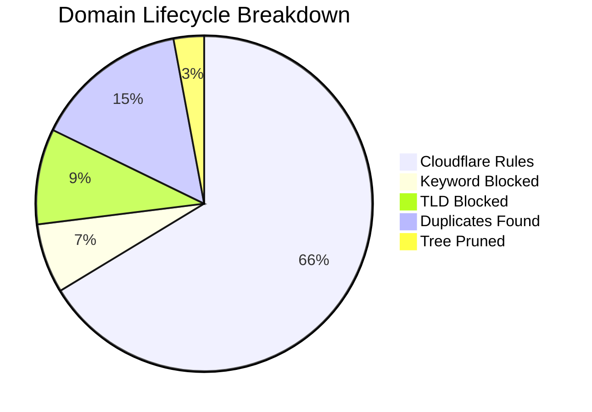

# 🛡️ Isaac's Cloudflare Intelligence Report
> **Last Update:** `2026-02-17 23:37:00` | **Sync Runtime:** `137.83s`

## 📊 Visual Insights

---

## 📋 Summary Metrics
| Metric | Count | % of Raw |
| :--- | :--- | :--- |
| **Total Raw Fetched** | 419,569 | 100% |
| **Aggressive Keyword Hit** | - 28,092 | 6.7% |
| **Banned TLD Block** | - 38,590 | 9.2% |
| **Duplicate/Tree Pruning** | - 74,496 | -- |
| **Active Rules Sent** | **277,941** | **66.2%** |

---

## 🚩 Top 12 Keyword Analytics
| `sex` | 10,096 |
| `porn` | 10,007 |
| `xxx` | 3,349 |
| `hentai` | 664 |
| `xnxx` | 628 |
| `milf` | 501 |
| `fuck` | 446 |
| `erotic` | 431 |
| `pussy` | 266 |
| `xxvideo` | 254 |
| `bdsm` | 249 |
| `xvideo` | 245 |

---

## 🛰️ Provider Analytics (Uniqueness)
| Source | Raw Ingest | Valid Pool | Unique Contribution |
| :--- | :--- | :--- | :--- |
| Hagezi Anti-Piracy | 11,672 | 10,281 | **98.1%** |
| HaGeZi Fake | 13,954 | 13,720 | **97.0%** |
| Hagezi SafeSearch Not Supported | 214 | 186 | **98.4%** |
| Hagezi NSFW | 67,359 | 34,307 | **98.8%** |
| HaGeZi Pro++ | 232,625 | 206,226 | **69.9%** |
| 1Hosts Lite | 93,745 | 87,717 | **30.1%** |

---

## 🛠️ Infrastructure Health
* **Avg Entropy (Randomness):** `3.448`
* **Max Domain Length:** `179`
* **Cloudflare Quota Usage:** `92.65%`
