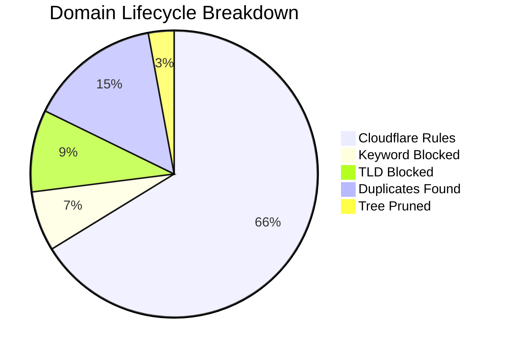

# 🛡️ Isaac's Cloudflare Intelligence Report
> **Last Update:** `2026-02-15 15:31:53` | **Sync Runtime:** `92.31s`

## 📊 Visual Insights

---

## 📋 Summary Metrics
| Metric | Count | % of Raw |
| :--- | :--- | :--- |
| **Total Raw Fetched** | 425,619 | 100% |
| **Aggressive Keyword Hit** | - 28,723 | 6.7% |
| **Banned TLD Block** | - 39,324 | 9.2% |
| **Duplicate/Tree Pruning** | - 75,495 | -- |
| **Active Rules Sent** | **281,595** | **66.2%** |

---

## 🚩 Top 12 Keyword Analytics
| `sex` | 11,165 |
| `porn` | 9,793 |
| `xxx` | 3,311 |
| `hentai` | 665 |
| `xnxx` | 600 |
| `milf` | 513 |
| `fuck` | 490 |
| `erotic` | 446 |
| `bdsm` | 269 |
| `xvideo` | 244 |
| `pussy` | 239 |
| `horny` | 239 |

---

## 🛰️ Provider Analytics (Uniqueness)
| Source | Raw Ingest | Valid Pool | Unique Contribution |
| :--- | :--- | :--- | :--- |
| Hagezi Anti-Piracy | 11,739 | 10,349 | **98.0%** |
| HaGeZi Fake | 14,121 | 13,878 | **96.9%** |
| Hagezi SafeSearch Not Supported | 214 | 186 | **98.4%** |
| Hagezi NSFW | 68,609 | 34,667 | **98.8%** |
| HaGeZi Pro++ | 236,886 | 209,976 | **70.0%** |
| 1Hosts Lite | 94,050 | 88,034 | **29.2%** |

---

## 🛠️ Infrastructure Health
* **Avg Entropy (Randomness):** `3.448`
* **Max Domain Length:** `179`
* **Cloudflare Quota Usage:** `93.86%`
