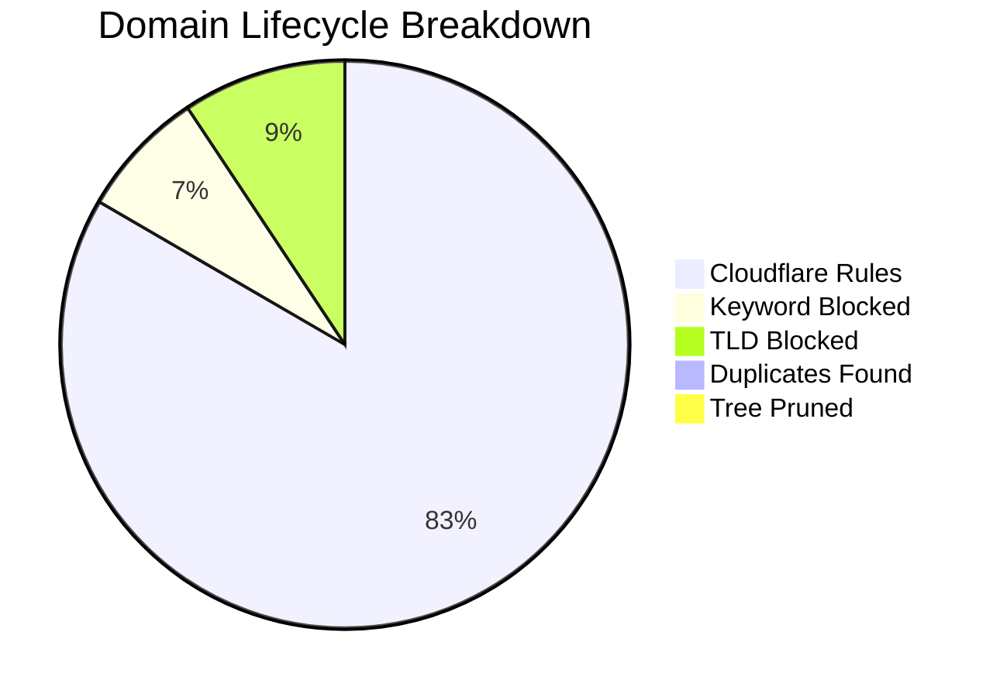

# 🛡️ Isaac's Cloudflare Intelligence Report
> **Last Update:** `2026-02-14 19:19:47` | **Sync Runtime:** `108.26s`

## 📊 Visual Insights

---

## 📋 Summary Metrics
| Metric | Count | % of Raw |
| :--- | :--- | :--- |
| **Total Raw Fetched** | 379,137 | 100% |
| **Aggressive Keyword Hit** | - 27,444 | 7.2% |
| **Banned TLD Block** | - 35,118 | 9.3% |
| **Duplicate/Tree Pruning** | - 2,150 | -- |
| **Active Rules Sent** | **313,914** | **82.8%** |

---

## 🚩 Top 12 Keyword Analytics
| `porn` | 9,907 |
| `sex` | 9,059 |
| `xxx` | 2,972 |
| `sexy` | 977 |
| `hentai` | 683 |
| `xnxx` | 543 |
| `milf` | 509 |
| `erotic` | 437 |
| `fuck` | 427 |
| `pussy` | 276 |
| `shemale` | 261 |
| `xvideo` | 253 |

---

## 🛰️ Provider Analytics (Uniqueness)
| Source | Raw Ingest | Valid Pool | Unique Contribution |
| :--- | :--- | :--- | :--- |
| Hagezi SafeSearch Not Supported | 214 | 186 | **97.8%** |
| HaGeZi Fake | 14,148 | 13,907 | **96.5%** |
| Hagezi Anti-Piracy | 11,743 | 10,355 | **98.0%** |
| HaGeZi Ultimate | 286,273 | 257,475 | **99.6%** |
| Hagezi NSFW | 66,759 | 34,141 | **98.7%** |

---

## 🛠️ Infrastructure Health
* **Avg Entropy (Randomness):** `3.455`
* **Max Domain Length:** `179`
* **Cloudflare Quota Usage:** `104.64%`
