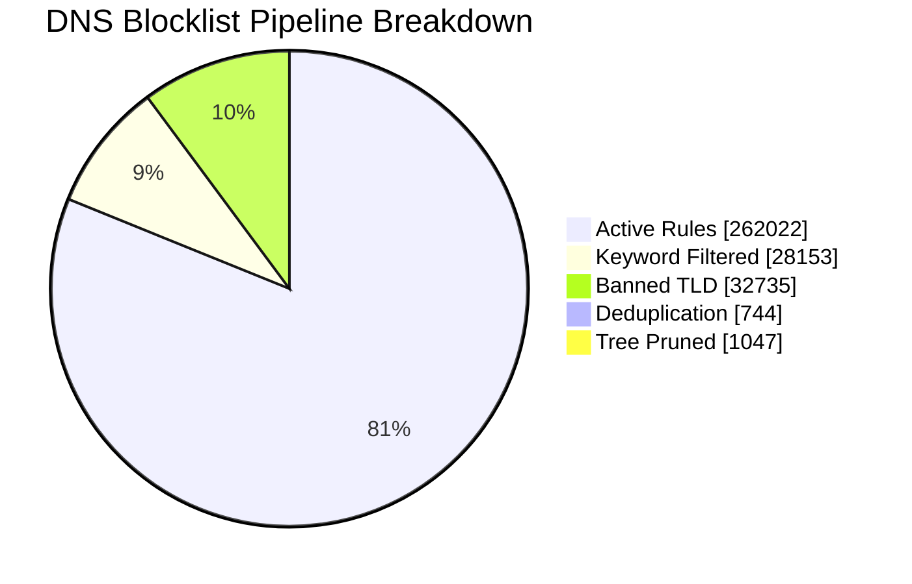
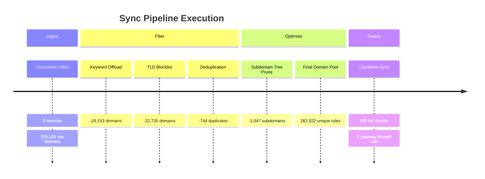

<!--
  Auto-generated by sync_blocklist.py — do not edit manually.
  Changes will be overwritten on next sync.
-->

<div align="center">

# 🛡️ DNS Intelligence Report

**Cloudflare Gateway · Ads, Tracker, Telemetry & Malware Blocklist**


</div>

---

## ⚡ At a Glance

| | Metric | Value | |
|:---:|:---|---:|:---|
| 🌐 | **Sources Active** | `5` | feeds ingested this sync |
| 📥 | **Raw Domains Fetched** | `325,026` | before any filtering |
| ✅ | **Active Block Rules** | `262,022` | pushed to Cloudflare |
| 🧹 | **Total Filtered Out** | `63,004` | noise removed |
| 🔁 | **Duplicates Removed** | `744` | cross-source overlap |
| 🌳 | **Subdomains Tree-Pruned** | `1,047` | covered by parent rule |
| ⏱️ | **Sync Runtime** | `77.54s` | wall clock |
| 📦 | **Cloudflare List Chunks** | `263` | × 1,000 domains each |

---

## 📊 Pipeline Funnel

> From **325,026 raw domains** down to **262,022 precision block rules** — a 19.4% reduction in noise.


```mermaid
pie showData title DNS Blocklist Pipeline Breakdown
    "Active Rules"     : 262022
    "Keyword Filtered" : 28153
    "Banned TLD"       : 32735
    "Deduplication"    : 744
    "Tree Pruned"      : 1047
```

---

## 🗺️ Execution Timeline


```mermaid
timeline
    title Sync Pipeline Execution
    section Ingest
        Concurrent Fetch   : 5 sources
                           : 325,026 raw domains
    section Filter
        Keyword Offload    : -28,153 domains
        TLD Blocklist      : -32,735 domains
        Deduplication      : -744 duplicates
    section Optimise
        Subdomain Tree Prune : -1,047 subdomains
        Final Domain Pool    : 262,022 unique rules
    section Deploy
        Cloudflare Sync    : 263 list chunks
                           : 1 gateway firewall rule
```

---

## 📉 Cloudflare Quota Consumption

```
Gateway Rule Limit: 300,000
███████████████████████████████████░░░░░  87.3%  262,022 / 300,000  [🟠 High]
```

### Filter Stage Breakdown

| Stage | Domains | Share of Raw | Visual |
| :--- | ---: | ---: | :--- |
| 🔴 Keyword Filtered  | 28,153  | 8.66%  | `██░░░░░░░░░░░░░░░░░░░░░░░░░░  8.7%` |
| 🟠 Banned TLD        | 32,735 | 10.07% | `███░░░░░░░░░░░░░░░░░░░░░░░░░  10.1%` |
| 🟡 Dedup + Tree Prune | 1,791 | 0.55% | `░░░░░░░░░░░░░░░░░░░░░░░░░░░░  0.6%` |
| 🟢 **Active Rules**  | **262,022** | **80.62%** | `███████████████████████░░░░░  80.6%` |

---

## 🛰️ Source Intelligence

```mermaid
xychart-beta horizontal
    title "Source — Valid Domains Ingested"
    x-axis ['"Hagezi SafeSearch Not "', '"Hagezi Anti-Piracy"', '"HaGeZi Fake"', '"Hagezi NSFW"', '"HaGeZi Pro++"']
    y-axis "Domains"
    bar [186, 10298, 13758, 34435, 205136]
    line [186, 10298, 13758, 34435, 205136]
```

### Uniqueness Ranking

> The **line** in the chart above shows unique-only contribution per source.
> A source with high valid count but low uniqueness is largely redundant.

| Source | Raw Ingest | Valid | Unique Only | Uniqueness Bar | Rank |
| :--- | ---: | ---: | ---: | :--- | :---: |
| HaGeZi Pro++ |    231,336 |    205,136 |   205,136 | `████████████████  100.0%` | 🥇 |
| Hagezi NSFW |     67,787 |     34,435 |    34,435 | `████████████████  100.0%` | 🥈 |
| HaGeZi Fake |     13,991 |     13,758 |    13,758 | `████████████████  100.0%` | 🥉 |
| Hagezi Anti-Piracy |     11,698 |     10,298 |    10,298 | `████████████████  100.0%` | · |
| Hagezi SafeSearch Not Supported |        214 |        186 |       186 | `████████████████  100.0%` | · |

### Source Quality Matrix

> **X-axis:** what % of a source's domains are unique (not in any other source).
> **Y-axis:** average domain length — longer domains tend to be more specific / less spammy.

```mermaid
quadrantChart
    title Source Quality Matrix (Uniqueness vs Avg Domain Length)
    x-axis "Low Uniqueness" --> "High Uniqueness"
    y-axis "Short Domains" --> "Long Domains"
    quadrant-1 High Signal
    quadrant-2 Deep Coverage
    quadrant-3 Redundant
    quadrant-4 Short & Unique
        Hagezi SafeSearch No(100.0, 16.0)
        Hagezi Anti-Piracy(100.0, 14.0)
        HaGeZi Fake(100.0, 16.0)
        Hagezi NSFW(100.0, 15.0)
        HaGeZi Pro++(100.0, 19.0)
```

---

## 🚫 Keyword Filter Intelligence

```mermaid
xychart-beta
    title "Top 10 Offloaded Keyword Hits"
    x-axis ['"sex"', '"porn"', '"xxx"', '"hentai"', '"milf"', '"erotic"', '"fuck"', '"xnxx"', '"bdsm"', '"shemale"']
    y-axis "Blocked Domains"
    bar [10968, 9562, 3457, 647, 518, 443, 421, 290, 282, 252]
```

### Full Keyword Hit Table (Top 15)

| Keyword | Blocked | Distribution |
| :--- | ---: | :--- |
| `sex                 ` |   10,968 | `██████████████████████  100.0%` |
| `porn                ` |    9,562 | `███████████████████░░░  87.2%` |
| `xxx                 ` |    3,457 | `███████░░░░░░░░░░░░░░░  31.5%` |
| `hentai              ` |      647 | `█░░░░░░░░░░░░░░░░░░░░░  5.9%` |
| `milf                ` |      518 | `█░░░░░░░░░░░░░░░░░░░░░  4.7%` |
| `erotic              ` |      443 | `█░░░░░░░░░░░░░░░░░░░░░  4.0%` |
| `fuck                ` |      421 | `█░░░░░░░░░░░░░░░░░░░░░  3.8%` |
| `xnxx                ` |      290 | `█░░░░░░░░░░░░░░░░░░░░░  2.6%` |
| `bdsm                ` |      282 | `█░░░░░░░░░░░░░░░░░░░░░  2.6%` |
| `shemale             ` |      252 | `█░░░░░░░░░░░░░░░░░░░░░  2.3%` |
| `xvideo              ` |      251 | `█░░░░░░░░░░░░░░░░░░░░░  2.3%` |
| `pussy               ` |      230 | `░░░░░░░░░░░░░░░░░░░░░░  2.1%` |
| `horny               ` |      217 | `░░░░░░░░░░░░░░░░░░░░░░  2.0%` |
| `tits                ` |      121 | `░░░░░░░░░░░░░░░░░░░░░░  1.1%` |
| `pornhub             ` |      117 | `░░░░░░░░░░░░░░░░░░░░░░  1.1%` |

---

## 🌍 Banned TLD Intelligence

```mermaid
xychart-beta
    title "Top Banned TLD Hits"
    x-axis ['".top"', '".ru"', '".xyz"', '".cn"', '".click"', '".cfd"', '".cc"', '".sbs"', '".icu"', '".casino"']
    y-axis "Blocked Domains"
    bar [6264, 5145, 4583, 2712, 2564, 2049, 1557, 1522, 1413, 1182]
```

### Top Offending TLDs

| TLD | Blocked | Distribution |
| :--- | ---: | :--- |
| `.top         ` |    6,264 | `██████████████████████  100.0%` |
| `.ru          ` |    5,145 | `██████████████████░░░░  82.1%` |
| `.xyz         ` |    4,583 | `████████████████░░░░░░  73.2%` |
| `.cn          ` |    2,712 | `██████████░░░░░░░░░░░░  43.3%` |
| `.click       ` |    2,564 | `█████████░░░░░░░░░░░░░  40.9%` |
| `.cfd         ` |    2,049 | `███████░░░░░░░░░░░░░░░  32.7%` |
| `.cc          ` |    1,557 | `█████░░░░░░░░░░░░░░░░░  24.9%` |
| `.sbs         ` |    1,522 | `█████░░░░░░░░░░░░░░░░░  24.3%` |
| `.icu         ` |    1,413 | `█████░░░░░░░░░░░░░░░░░  22.6%` |
| `.casino      ` |    1,182 | `████░░░░░░░░░░░░░░░░░░  18.9%` |

---

## 🔬 Domain Health & Entropy

| Metric | Value | Interpretation |
| :--- | :--- | :--- |
| **Avg Shannon Entropy** | `3.452 bits` | 🟢 Normal — human-readable domains |
| **Max Domain Length** | `179 chars` | longest domain in the active ruleset |
| **Entropy Distribution** | `      ▁▄█▅` | low entropy → high entropy (across 5k sample) |

> **Shannon Entropy** measures character randomness per domain string.
> Scores above `4.0` may indicate algorithmically-generated domains (DGA malware).
> Human-readable ad/tracker domains typically score between `2.5` and `3.5`.

---

## ⚙️ Configuration Reference

| Parameter | Value | Description |
| :--- | :--- | :--- |
| `TOTAL_QUOTA` | `300,000` | Cloudflare Gateway rule limit |
| `MAX_LIST_SIZE` | `1,000` | Domains per list chunk |
| `MAX_WORKERS` | `5` | Concurrent fetch threads |
| `MAX_RETRIES` | `3` | Per-request retry attempts |
| `TOP_KEYWORDS` | `15` | Rows shown in keyword table |
| `TOP_TLDS` | `10` | Rows shown in TLD table |

---

<div align="center">

*Auto-generated · `2026-02-22 16:37:55` · [sync_blocklist.py](./sync_blocklist.py)*

</div>
