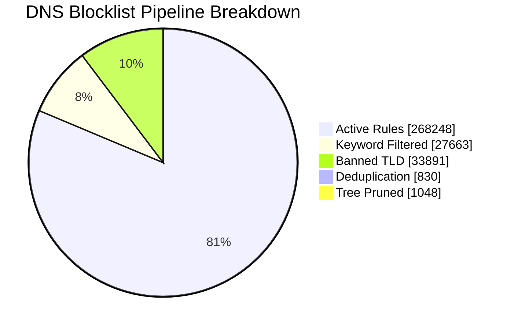

<!--
  Auto-generated by sync_blocklist.py — do not edit manually.
  Changes will be overwritten on next sync.
-->

<div align="center">

# 🛡️ DNS Intelligence Report

**Cloudflare Gateway · Ads, Tracker, Telemetry & Malware Blocklist**


</div>

---

## ⚡ At a Glance

| | Metric | Value | |
|:---:|:---|---:|:---|
| 🌐 | **Sources Active** | `5` | feeds ingested this sync |
| 📥 | **Raw Domains Fetched** | `332,133` | before any filtering |
| ✅ | **Active Block Rules** | `268,248` | pushed to Cloudflare |
| 🧹 | **Total Filtered Out** | `63,885` | noise removed |
| 🔁 | **Duplicates Removed** | `830` | cross-source overlap |
| 🌳 | **Subdomains Tree-Pruned** | `1,048` | covered by parent rule |
| ⏱️ | **Sync Runtime** | `96.01s` | wall clock |
| 📦 | **Cloudflare List Chunks** | `269` | × 1,000 domains each |

---

## 📊 Pipeline Funnel

> From **332,133 raw domains** down to **268,248 precision block rules** — a 19.2% reduction in noise.


```mermaid
pie showData title DNS Blocklist Pipeline Breakdown
    "Active Rules"     : 268248
    "Keyword Filtered" : 27663
    "Banned TLD"       : 33891
    "Deduplication"    : 830
    "Tree Pruned"      : 1048
```

---

## 🗺️ Execution Timeline


```mermaid
timeline
    title Sync Pipeline Execution
    section Ingest
        Concurrent Fetch   : 5 sources
                           : 332,133 raw domains
    section Filter
        Keyword Offload    : -27,663 domains
        TLD Blocklist      : -33,891 domains
        Deduplication      : -830 duplicates
    section Optimise
        Subdomain Tree Prune : -1,048 subdomains
        Final Domain Pool    : 268,248 unique rules
    section Deploy
        Cloudflare Sync    : 269 list chunks
                           : 1 gateway firewall rule
```

---

## 📉 Cloudflare Quota Consumption

```
Gateway Rule Limit: 300,000
████████████████████████████████████░░░░  89.4%  268,248 / 300,000  [🟠 High]
```

### Filter Stage Breakdown

| Stage | Domains | Share of Raw | Visual |
| :--- | ---: | ---: | :--- |
| 🔴 Keyword Filtered  | 27,663  | 8.33%  | `██░░░░░░░░░░░░░░░░░░░░░░░░░░  8.3%` |
| 🟠 Banned TLD        | 33,891 | 10.2% | `███░░░░░░░░░░░░░░░░░░░░░░░░░  10.2%` |
| 🟡 Dedup + Tree Prune | 1,878 | 0.57% | `░░░░░░░░░░░░░░░░░░░░░░░░░░░░  0.6%` |
| 🟢 **Active Rules**  | **268,248** | **80.77%** | `███████████████████████░░░░░  80.8%` |

---

## 🛰️ Source Intelligence

```mermaid
xychart-beta horizontal
    title "Source — Valid Domains Ingested"
    x-axis ['"HaGeZi Fake"', '"Hagezi Anti-Piracy"', '"Hagezi SafeSearch Not "', '"Hagezi NSFW"', '"HaGeZi Pro++"']
    y-axis "Domains"
    bar [13908, 10220, 186, 34062, 211750]
    line [13908, 10220, 186, 34062, 211750]
```

### Uniqueness Ranking

> The **line** in the chart above shows unique-only contribution per source.
> A source with high valid count but low uniqueness is largely redundant.

| Source | Raw Ingest | Valid | Unique Only | Uniqueness Bar | Rank |
| :--- | ---: | ---: | ---: | :--- | :---: |
| HaGeZi Pro++ |    239,348 |    211,750 |   211,750 | `████████████████  100.0%` | 🥇 |
| Hagezi NSFW |     66,821 |     34,062 |    34,062 | `████████████████  100.0%` | 🥈 |
| HaGeZi Fake |     14,139 |     13,908 |    13,908 | `████████████████  100.0%` | 🥉 |
| Hagezi Anti-Piracy |     11,611 |     10,220 |    10,220 | `████████████████  100.0%` | · |
| Hagezi SafeSearch Not Supported |        214 |        186 |       186 | `████████████████  100.0%` | · |

### Source Quality Matrix

> **X-axis:** what % of a source's domains are unique (not in any other source).
> **Y-axis:** average domain length — longer domains tend to be more specific / less spammy.

```mermaid
quadrantChart
    title Source Quality Matrix (Uniqueness vs Avg Domain Length)
    x-axis "Low Uniqueness" --> "High Uniqueness"
    y-axis "Short Domains" --> "Long Domains"
    quadrant-1 High Signal
    quadrant-2 Deep Coverage
    quadrant-3 Redundant
    quadrant-4 Short & Unique
        HaGeZi Fake(100.0, 16.0)
        Hagezi Anti-Piracy(100.0, 14.0)
        Hagezi SafeSearch No(100.0, 16.0)
        Hagezi NSFW(100.0, 15.0)
        HaGeZi Pro++(100.0, 19.0)
```

---

## 🚫 Keyword Filter Intelligence

```mermaid
xychart-beta
    title "Top 10 Offloaded Keyword Hits"
    x-axis ['"porn"', '"sex"', '"xxx"', '"sexy"', '"hentai"', '"milf"', '"fuck"', '"erotic"', '"xvideo"', '"xnxx"']
    y-axis "Blocked Domains"
    bar [9459, 8812, 4258, 952, 660, 482, 450, 439, 390, 318]
```

### Full Keyword Hit Table (Top 15)

| Keyword | Blocked | Distribution |
| :--- | ---: | :--- |
| `porn                ` |    9,459 | `██████████████████████  100.0%` |
| `sex                 ` |    8,812 | `████████████████████░░  93.2%` |
| `xxx                 ` |    4,258 | `██████████░░░░░░░░░░░░  45.0%` |
| `sexy                ` |      952 | `██░░░░░░░░░░░░░░░░░░░░  10.1%` |
| `hentai              ` |      660 | `██░░░░░░░░░░░░░░░░░░░░  7.0%` |
| `milf                ` |      482 | `█░░░░░░░░░░░░░░░░░░░░░  5.1%` |
| `fuck                ` |      450 | `█░░░░░░░░░░░░░░░░░░░░░  4.8%` |
| `erotic              ` |      439 | `█░░░░░░░░░░░░░░░░░░░░░  4.6%` |
| `xvideo              ` |      390 | `█░░░░░░░░░░░░░░░░░░░░░  4.1%` |
| `xnxx                ` |      318 | `█░░░░░░░░░░░░░░░░░░░░░  3.4%` |
| `bdsm                ` |      275 | `█░░░░░░░░░░░░░░░░░░░░░  2.9%` |
| `pussy               ` |      238 | `█░░░░░░░░░░░░░░░░░░░░░  2.5%` |
| `shemale             ` |      217 | `█░░░░░░░░░░░░░░░░░░░░░  2.3%` |
| `horny               ` |      214 | `░░░░░░░░░░░░░░░░░░░░░░  2.3%` |
| `tits                ` |      126 | `░░░░░░░░░░░░░░░░░░░░░░  1.3%` |

---

## 🌍 Banned TLD Intelligence

```mermaid
xychart-beta
    title "Top Banned TLD Hits"
    x-axis ['".top"', '".xyz"', '".ru"', '".click"', '".cn"', '".cfd"', '".sbs"', '".cc"', '".icu"', '".rest"']
    y-axis "Blocked Domains"
    bar [6778, 5234, 4973, 2983, 2715, 2180, 1920, 1615, 1477, 773]
```

### Top Offending TLDs

| TLD | Blocked | Distribution |
| :--- | ---: | :--- |
| `.top         ` |    6,778 | `██████████████████████  100.0%` |
| `.xyz         ` |    5,234 | `█████████████████░░░░░  77.2%` |
| `.ru          ` |    4,973 | `████████████████░░░░░░  73.4%` |
| `.click       ` |    2,983 | `██████████░░░░░░░░░░░░  44.0%` |
| `.cn          ` |    2,715 | `█████████░░░░░░░░░░░░░  40.1%` |
| `.cfd         ` |    2,180 | `███████░░░░░░░░░░░░░░░  32.2%` |
| `.sbs         ` |    1,920 | `██████░░░░░░░░░░░░░░░░  28.3%` |
| `.cc          ` |    1,615 | `█████░░░░░░░░░░░░░░░░░  23.8%` |
| `.icu         ` |    1,477 | `█████░░░░░░░░░░░░░░░░░  21.8%` |
| `.rest        ` |      773 | `███░░░░░░░░░░░░░░░░░░░  11.4%` |

---

## 🔬 Domain Health & Entropy

| Metric | Value | Interpretation |
| :--- | :--- | :--- |
| **Avg Shannon Entropy** | `3.452 bits` | 🟢 Normal — human-readable domains |
| **Max Domain Length** | `179 chars` | longest domain in the active ruleset |
| **Entropy Distribution** | `      ▁▄█▅` | low entropy → high entropy (across 5k sample) |

> **Shannon Entropy** measures character randomness per domain string.
> Scores above `4.0` may indicate algorithmically-generated domains (DGA malware).
> Human-readable ad/tracker domains typically score between `2.5` and `3.5`.

---

## ⚙️ Configuration Reference

| Parameter | Value | Description |
| :--- | :--- | :--- |
| `TOTAL_QUOTA` | `300,000` | Cloudflare Gateway rule limit |
| `MAX_LIST_SIZE` | `1,000` | Domains per list chunk |
| `MAX_WORKERS` | `5` | Concurrent fetch threads |
| `MAX_RETRIES` | `3` | Per-request retry attempts |
| `TOP_KEYWORDS` | `15` | Rows shown in keyword table |
| `TOP_TLDS` | `10` | Rows shown in TLD table |

---

<div align="center">

*Auto-generated · `2026-02-23 17:05:51` · [sync_blocklist.py](./sync_blocklist.py)*

</div>
