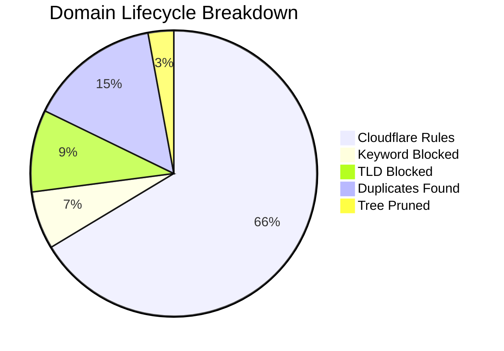

# 🛡️ Isaac's Cloudflare Intelligence Report
> **Last Update:** `2026-02-14 19:30:26` | **Sync Runtime:** `98.36s`

## 📊 Visual Insights

---

## 📋 Summary Metrics
| Metric | Count | % of Raw |
| :--- | :--- | :--- |
| **Total Raw Fetched** | 422,066 | 100% |
| **Aggressive Keyword Hit** | - 27,636 | 6.5% |
| **Banned TLD Block** | - 39,139 | 9.3% |
| **Duplicate/Tree Pruning** | - 74,992 | -- |
| **Active Rules Sent** | **279,818** | **66.3%** |

---

## 🚩 Top 12 Keyword Analytics
| `sex` | 9,744 |
| `porn` | 9,029 |
| `xxx` | 4,118 |
| `hentai` | 696 |
| `milf` | 486 |
| `fuck` | 449 |
| `erotic` | 439 |
| `xvideo` | 435 |
| `xnxx` | 282 |
| `pussy` | 267 |
| `xxvideo` | 263 |
| `bdsm` | 262 |

---

## 🛰️ Provider Analytics (Uniqueness)
| Source | Raw Ingest | Valid Pool | Unique Contribution |
| :--- | :--- | :--- | :--- |
| HaGeZi Fake | 14,148 | 13,907 | **97.3%** |
| Hagezi SafeSearch Not Supported | 214 | 186 | **98.4%** |
| Hagezi Anti-Piracy | 11,743 | 10,355 | **98.1%** |
| 1Hosts Lite | 93,873 | 87,865 | **29.5%** |
| Hagezi NSFW | 66,759 | 34,141 | **98.8%** |
| HaGeZi Pro++ | 235,329 | 208,356 | **70.0%** |

---

## 🛠️ Infrastructure Health
* **Avg Entropy (Randomness):** `3.449`
* **Max Domain Length:** `179`
* **Cloudflare Quota Usage:** `93.27%`
