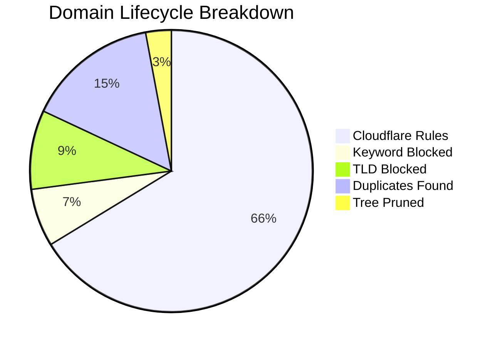

# 🛡️ Isaac's Cloudflare Intelligence Report
> **Last Update:** `2026-02-18 22:39:29` | **Sync Runtime:** `86.29s`

## 📊 Visual Insights

---

## 📋 Summary Metrics
| Metric | Count | % of Raw |
| :--- | :--- | :--- |
| **Total Raw Fetched** | 419,535 | 100% |
| **Aggressive Keyword Hit** | - 27,828 | 6.6% |
| **Banned TLD Block** | - 38,005 | 9.1% |
| **Duplicate/Tree Pruning** | - 75,533 | -- |
| **Active Rules Sent** | **277,846** | **66.2%** |

---

## 🚩 Top 12 Keyword Analytics
| `sex` | 10,395 |
| `porn` | 9,948 |
| `xxx` | 3,259 |
| `hentai` | 661 |
| `milf` | 548 |
| `fuck` | 470 |
| `erotic` | 430 |
| `xnxx` | 279 |
| `pussy` | 260 |
| `xvideo` | 251 |
| `bdsm` | 247 |
| `horny` | 219 |

---

## 🛰️ Provider Analytics (Uniqueness)
| Source | Raw Ingest | Valid Pool | Unique Contribution |
| :--- | :--- | :--- | :--- |
| Hagezi SafeSearch Not Supported | 214 | 186 | **98.4%** |
| HaGeZi Fake | 13,952 | 13,719 | **97.7%** |
| Hagezi Anti-Piracy | 11,681 | 10,287 | **98.1%** |
| Hagezi NSFW | 66,878 | 34,243 | **98.8%** |
| 1Hosts Lite | 93,558 | 87,652 | **28.7%** |
| HaGeZi Pro++ | 233,252 | 207,292 | **69.6%** |

---

## 🛠️ Infrastructure Health
* **Avg Entropy (Randomness):** `3.452`
* **Max Domain Length:** `179`
* **Cloudflare Quota Usage:** `92.62%`
